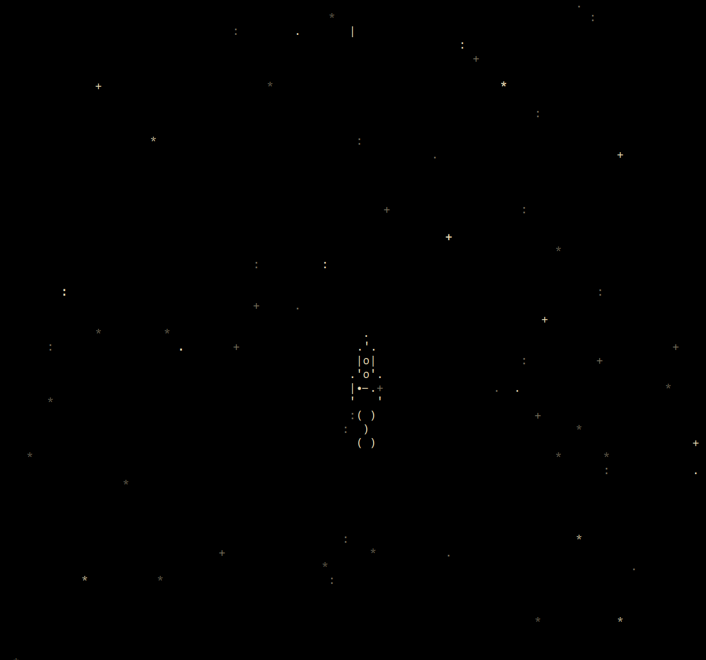

# Игра "Spaceship in the Galaxy"



## Описание
- На экране отображается "космическое небо" — случайно мигающие звезды.

- В центре находится анимированный корабль, управляемый с клавиатуры.

- Всё работает асинхронно: можно добавлять новые анимации, не блокируя игру.


## Требования

- Тестировалось на `Python 3.12`.
- Linux Mint 21.

На других оболочках и версиях роботоспособность возможна, но не гарантирована.


## Управление караблем

- `↑` - вверх
- `↓` - вниз
- `←` - влево
- `→` - вправо

## Структура проекта

```
space-game/
│
├── src/
   ├── main.py            # Главный файл запуска
   ├── animation/         # Анимации 
   │   └── shot.py        # Анимация выстрела
   ├── curses_tools.py    # Вспомогательные функции для curses
   │   └── frame.py       # Работа с текстовыми фреймами
   │   └── key_control.py # Работа с клавиатурой
   └── frames/            # Текстовые фреймы корабля
       ├── starship_frame_1.txt
       └── starship_frame_2.txt
```